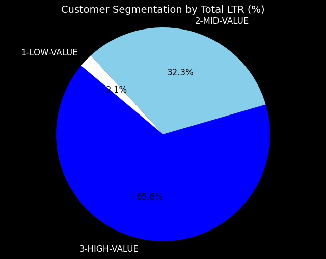
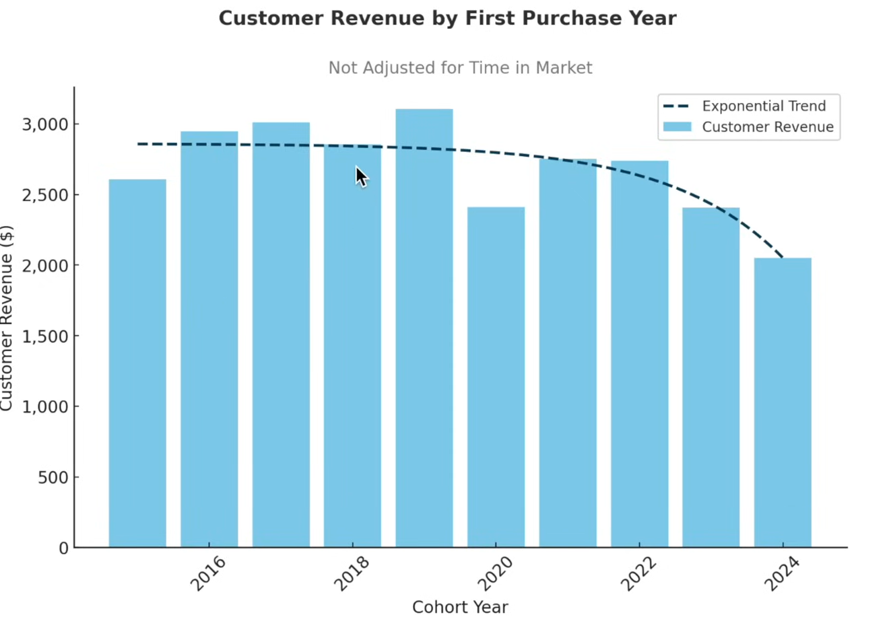
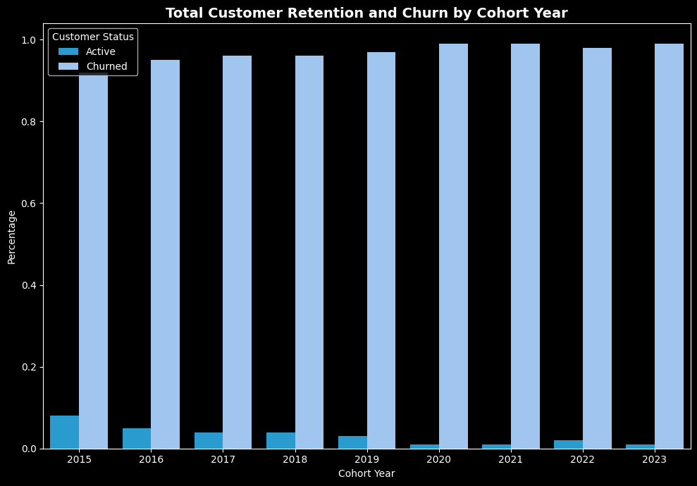

# INTERMEDIATE SQL- Sales Analysis

## Overview
Performed customer behavior, retention, and lifetime revenue analysis to enhance retention and drive revenue growth for an e-commerce business.

## Business Questions
1. **Customer Segmentation:** Who are our most valuable customers?

2. **Cohort_analysis:** How do different customer group generate revenue ?

3. **Retention Analysis:** Which customers haven't purchased recently?

## Analysis Approach
### 1.Customer Segmentation Analysis
⩥ Categorized customers based on total lifetime Revenue (LTR).

⩥ Segmented customers according to their value: High, Mid, and Low.

⩥ Computed key metric – total revenue.

**🖥️ Query:** [1_customer_segmentation.sql](/1.customer_segmentation.sql)

**📈 Visualization:** 

**📊 Key Findings :** 
- High-value segment (25% of customers) drives 66% of revenue ($135.4M)

- Mid-value segment (50% of customers) generates 32% of revenue ($66.6M)

- Low-value segment (25% of customers) accounts for 2% of revenue ($4.3M)

**💡Business Insights:** 
- High-Value (66% revenue): Launch VIP loyalty programs or premium services for 12,372 key customers to ensure retention, as each plays a critical role in revenue.

- Mid-Value (32% revenue): Drive revenue growth by offering personalized promotions and upgrade paths, aiming to convert this group towards high-value status.

- Low-Value (2% revenue): Deploy re-engagement campaigns and price-sensitive offers to boost purchase frequency and increase their revenue contribution.

### 2.Cohort Analysis
⩥ Analyzed revenue and customer counts across cohorts(common characteristic).

⩥ Customers were segmented based on their first purchase year.

⩥ Measured how well different customer groups stayed active over time.

**💻 Query:** [2_cohort_analysis.sql](/2.cohort_analysis.sql)

**📈 Visualization:** 

**📊 Key Findings :**
- Revenue per customer shows a declining trend over time, with newer cohorts (2022-2024) underperforming compared to earlier ones (2016-2021).

- NOTE: The rapid revenue growth might be due to a growing number of customers, not because each customer is spending more,this could hide a drop in the value of each individual customer.

**💡Business Insights:** 
- Newer customers from 2022-2024 spend less per person than older 2016-2021 customers, requiring better engagement or pricing adjustments to improve their spending.

- The company's revenue growth comes from adding more customers rather than getting existing ones to spend more, making it crucial to focus on keeping customers longer and selling them additional products.

- Immediate action is needed for 2022-2024 customers through loyalty programs or special offers, while also investigating why these newer customers stop doing business with the company.

### 3.Customer Retention Analysis
⩥ Checked how customer retention and churn changed from 2015 to 2023.

⩥ Calculated key numbers like how many customers stayed active or left (churned) each year.

⩥ Found groups of customers with a high chance of leaving, helping to plan ways to keep them.

**💻 Query:** [3_Retention_analysis.sql](/3.retention_analysis.sql)

**📈 Visualization:** 

**📊 Key Findings :**

- Retention remains consistently low (mostly below 10%) across all cohort years, highlighting a long-standing challenge in keeping customers engaged long-term.

- Older cohorts (2015–2019) experienced churn rates stabilizing around 90% within a few years, indicating that most customers leave after initial purchases.

- Recent cohorts (2022–2023) are already showing similar churn patterns early on, suggesting that unless retention strategies are improved, future customer groups will continue to follow the same trend.

**💡Business Insights:** 

- **Improve early customer engagement:**
Focus on the first 1–2 years by giving welcome offers, loyalty rewards, and personal deals, since most customers leave during this time. Keeping them early helps grow long-term value.

- **Bring back valuable lost customers!**
Focus on win-back campaigns for important past customers instead of everyone. Getting high-value customers back gives better results than finding new ones.

- **Stop churn before it happens:**
Use customer behavior signals like less activity or fewer purchases to spot customers likely to leave. Send special offers or help before they churn.

## Strategic Recommendations

**1. Revenue Optimization(Customer Segmentation)**

⇛ Launch VIP programs for 12,372 high-value customers contributing 66% of revenue ($135.4M).

⇛  Upsell mid-value customers ($66.6M) with personalized offers to boost them toward high-value.

⇛ Offer discounts and promotions to low-value customers to increase purchase frequency.

**2. Cohort Performance Strategy  (Customer revenue by cohort)**

⇛ Target 2022–2024 cohorts with personalized re-engagement offers to improve declining average revenue.

⇛ Launch loyalty or subscription programs to stabilize revenue and reduce customer churn.

⇛ Apply proven strategies from high-revenue 2016–2018 cohorts to boost newer customer performance.

**3. Retention & Churn Prevention (Customer Retention)**

⇛ Strengthen 1–2 year engagement with onboarding incentives and loyalty rewards to reduce early churn.

⇛ Run win-back campaigns targeting high-value churned customers to maximize recovery.

⇛ Implement proactive retention systems to identify and engage at-risk customers before they churn.

## Technical Details

- **Database:** PostgreSQL
- **Analysis Tools:** PostgreSQL, DBeaver, PGadmin
- **Visualization:** ChatGPT & Google Colab

